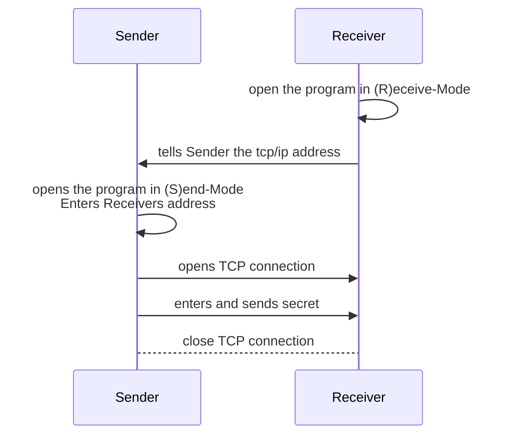

# Netshare

A small .net core application to share text data via a short lived TCP Connection.

## How to use

```mermaid
sequenceDiagram

    participant Sender
    participant Receiver

    Receiver->>Receiver: open the program in (R)eceive-Mode
    Receiver->>Sender: tells Sender the tcp/ip address
    Sender->>Sender: opens the program in (S)end-Mode<br>Enters Receivers address
    Sender->>Receiver: opens TCP connection
    Sender->>Receiver: enters and sends secret
    Sender-->Receiver: close TCP connection

```